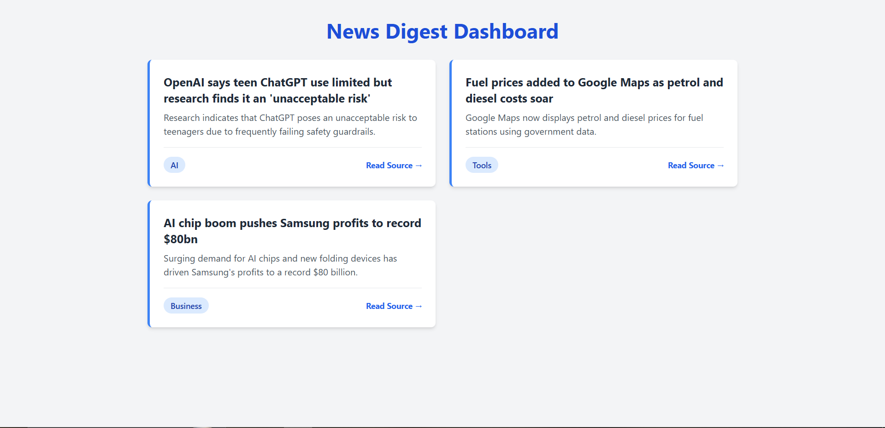
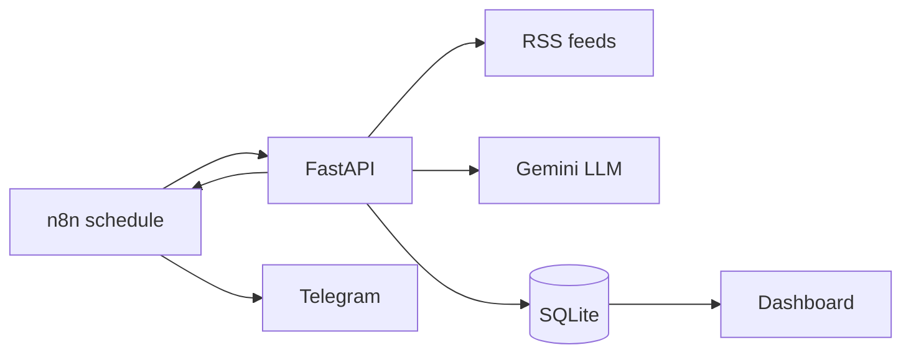

# News Digest

AI-powered news digest: collects tech news from RSS feeds, summarizes and classifies each item with an LLM, stores them in SQLite, and sends a daily digest to Telegram through an n8n workflow.


## Features
- RSS ingestion with whole-word keyword filtering
- LLM summarization and classification (Google Gemini)
- SQLite storage with duplicate prevention (each item is sent once)
- FastAPI backend with a small web dashboard
- n8n workflow that sends the digest to Telegram
- Docker and docker-compose setup
- Automated tests (pytest) and CI (GitHub Actions)

## Dashboard




## Architecture



## Quick Start

1. Copy `.env.example` to `.env` and add your Gemini API key:
```
   GEMINI_API_KEY=your_api_key_here
```
2. Run with Docker (starts the API and n8n):
```bash
   docker compose up --build
```
3. Open the dashboard at http://localhost:8000 (API docs at `/docs`) and n8n at http://localhost:5678

### Run without Docker

```bash
python -m venv venv
venv\Scripts\Activate.ps1
pip install -r requirements.txt
uvicorn app.main:app --reload
```

## API

| Endpoint | Description |
|---|---|
| `GET /` | Dashboard |
| `GET /health` | Health check |
| `GET /digest?limit=5` | Fetch new items, summarize them, store them, and return the digest |
| `GET /history?limit=20` | Stored items with summary and category |

## n8n Workflow

## n8n Workflow

Import `n8n/workflow.json` from the n8n UI (Workflows, then Import from File), then add your own Telegram credentials and chat ID. The workflow calls `/digest` on a schedule and sends the `text` field to Telegram.

When running with docker compose, n8n reaches the API through the compose network, so the HTTP Request node should use `http://api:8000/digest`. Without Docker, use `http://127.0.0.1:8000/digest`.

## Tests

```bash
pip install pytest
pytest
```

## Limitations
- Uses the Gemini free tier, which has daily request quotas. Items that fail summarization are not stored, so they are retried on the next run.
- Runs locally; there is no hosted deployment.

## Project History

- v0.1: RSS fetch script
- v0.2: FastAPI endpoints and n8n workflow
- v0.3: SQLite storage to avoid duplicates
- v0.4: LLM summarization and classification
- v0.5: Docker and docker-compose
- v0.6: pytest and GitHub Actions CI
- v1.0: Dashboard and full documentation